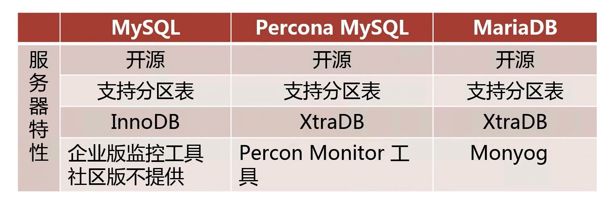
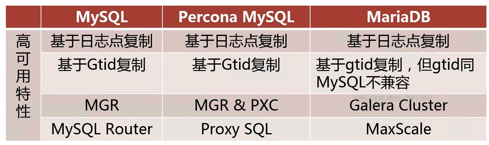
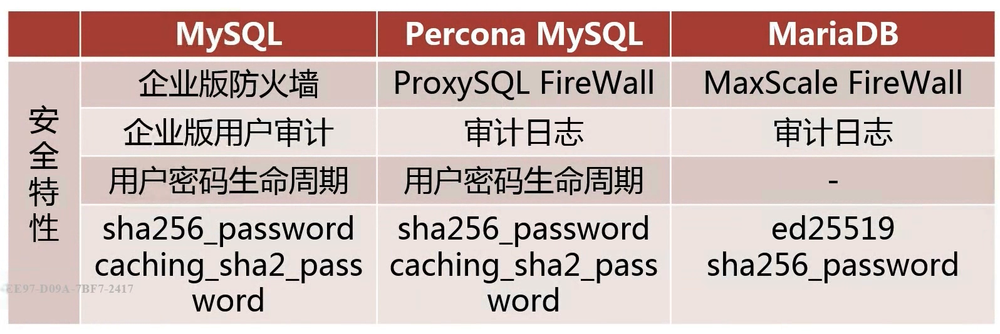
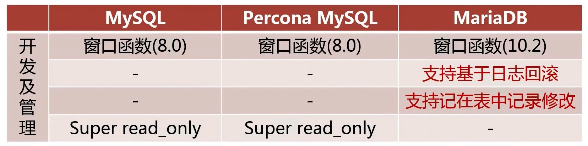
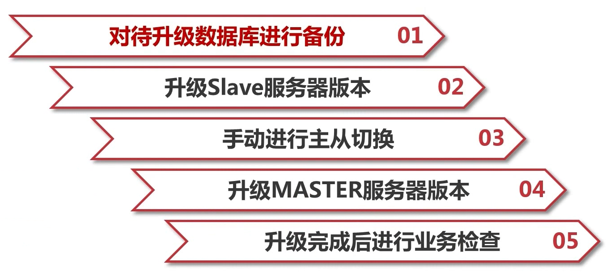
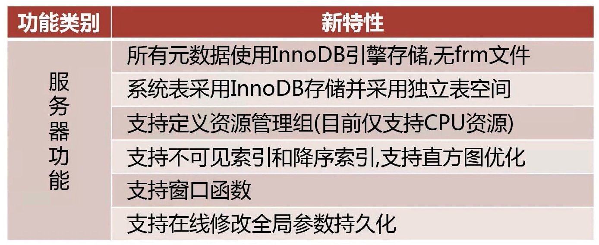
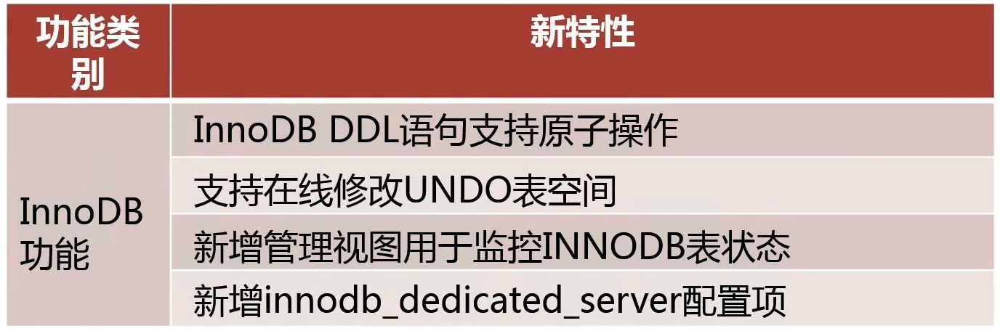

# MySQL版本类问题

[toc]

## 为什么选择某一版本的MySQL?

### 知识点

#### MySQL常见的发行版

+ MySQL 官方版本
  + 社区版
  + 企业版
+ Percona MySQL
+ MariaDB

#### 各个发行版之间的区别及优缺点

### 常见问题

+ 你之前工作中使用的是什么版本的MySQL?

+ 为什么选择这个版本

## 如何对MySQL进行升级?

### 知识点

#### 升级MySQL之前要考虑什么？

##### 升级可以给业务带来的益处

+ 是否可以解决业务上某一方面的痛点
+ 是否可以解决运维上某一方面的痛点

##### 升级可能对业务带来的影响

+ 对原业务程序的支持是否有影响
+ 对原业务程序的性能是否有影响

##### 数据库升级方案的制定

+ 评估受影响的业务系统
+ 升级的详细步骤

##### 数据库升级方案的制定

+ 升级后的数据库环境检查
+ 升级后的业务检查

##### 升级失败的回滚方案

+ 升级失败回滚的步骤
+ 回滚后的数据库环境检查
+ 回滚后的业务检查

#### MYSQL的升级步骤

### 常见问题

+ 你如何决定是否需要对MySQL进行升级？
+ 如何对MYSQL进行升级？

## 最新的MYSQL版本及其新特性

### 知识点

#### MYSQL 8.0主要的新特性

### 常见问题

+ 当前最新的MYSQL有什么特性比较吸引你