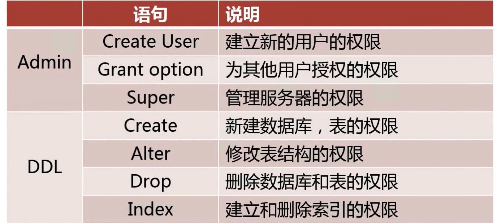
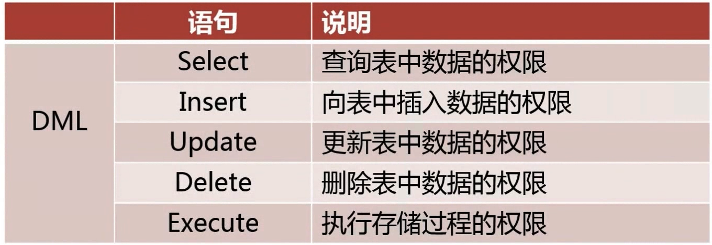
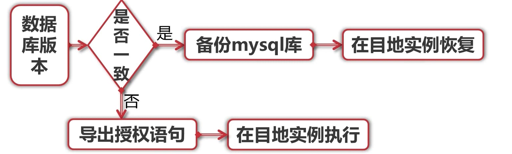
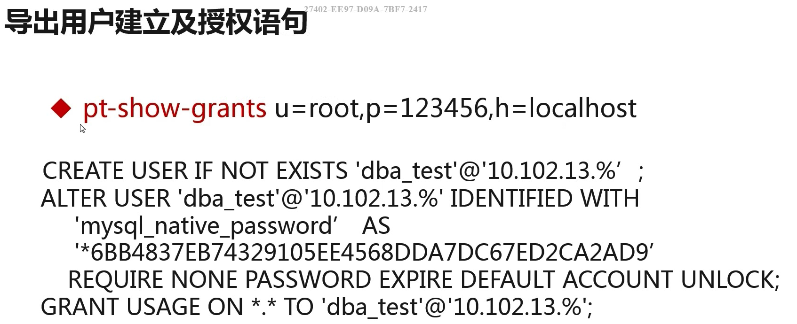

# 用户管理类问题

[TOC]

## 如何在给定场景下为某用户授权？

### 知识点

#### 如何定义MYSQL数据库账号？

+ 用户名@可访问控制列表

  > 可访问控制列表
  >
  > | 访问控制      | 说明                                         |
  > | ------------- | -------------------------------------------- |
  > | `%`           | 可以从所有外部主机访问(***不包括本地访问***) |
  > | `192.168.1.%` | 可以从`192.168.1`网段访问                    |
  > | `localhost`   | DB服务器本地访问                             |

+ 使用 `CREATE USER` 命令创建用户

#### MYSQL常用的用户权限





> `show privileg` 显示当前MYSQL服务器支持的权限列表

#### 如何为用户授权？

+ 遵循最小权限原则

+ 使用 `grant` 命令对用户授权

  > ```mysql
  > grant select,insert,update,delete on db.tb to user@ip;
  > ```

+ 使用 `revoke` 收回用户权限

  > ```mysql
  > revoke delete on db.tb from user@ip;
  > ```

## 如何保证数据库账号的安全？

### 知识点

#### 数据库用户管理流程规范


#### 密码强度

## 如何从一个实例迁移数据库账号到另一个实例？

###  解决思路





